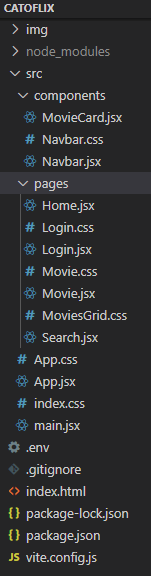

# Catoflix

Catoflix é um portal que dispõe o ranking de melhores produtos audiovisuais. Esta aplicação consome duas APIs. Uma API externa e pública de filmes e tv shows, com acesso disponibilizado a partir de uma key (chave) disponibilizada somente para esta aplicação, através de uma requisição de API no site do The Movie Database (TMDB). Já
 a outra API é a do Facebook, que fornece acesso à rede social para que seja realizado o acesso no portal através de Log In.

* [TMDB](https://www.themoviedb.org/)
* [Meta for Developers](https://developers.facebook.com/)

## Instituição Educacional

> [Centro Universitário Católica de Santa Catarina](https://www.catolicasc.org.br/)

## Autora do Projeto

> [Beatriz Mayorka de Aguiar](https://r.search.yahoo.com/_ylt=AwrFFBHUbpNjd.kKuDfz6Qt.;_ylu=Y29sbwNiZjEEcG9zAzEEdnRpZAMEc2VjA3Ny/RV=2/RE=1670635349/RO=10/RU=https%3a%2f%2fbr.linkedin.com%2fin%2fbeatriz-mayorka-de-aguiar-a40951198/RK=2/RS=HrNrLjPq9NAs0X_mJL3nVV95YUw-)

## Professor Orientador

> [Diogo Winck](https://github.com/dvwinck)

## Controle de Tarefas - Trello

* [Kanban do Projeto](https://trello.com/b/OHCqcUeJ/portif%C3%B3lio-de-projeto)

## Objetivo do Projeto

###### Este projeto teve como objetivo criar um portal, onde o usuário pudesse visualizar o ranking de melhores filmes do momento. Ele teria a possilidade de visualizar as informações sobre o filme, poderia pesquisar qualquer filme de sua escolha e teria o retorno do mesmo. 

###### Para que o usuário obtivesse acesso às informormações, seria necessário que o projeto consumisse uma API externa e aberta ao público, que contivesse os filmes, tv shows, etc..., e informações sobre eles.

###### A aplicação apresenta a interface onde o usuário pode visualizar o ranking de melhores produtos audiovisuais disponíveis, pesquisar o produto audiovisual de sua escolha e visualizar informações sobre o mesmo, estas que, por sua vez, estão em inglês por serem informações vindas de uma API de fora.  

## Como rodar o projeto

Ao clonar meu projeto em sua máquina, execute os comandos `npm install` e `npm install vite` para instalar as depêndencias do projeto, como mostra a seguir: 

Agora coloque o comando `npm run dev`

### Atenção

##### A url que deverá ser rodada no servidor e deverá estar na configuração do site Meta for Developers deve ser como a que está abaixo: 

`http://localhost:5173`

## Descrição do código

Para criar a tela de login foi utilizado a biblioteca `LoginSocialFacebook` que permitiu conectar a minha aplicação com a API do Facebook. Já para solicitar acesso aos dados do usuário
  foi utilizada a biblioteca <FacebookLoginButton>, que fornece o botão da rede social utilizada e assim que apertamos no botão e entramos na nossa conta, seguimos para a página que dá acesso
  ao ranking de melhores produtos audiovisuais disponíveis. Os dados do usuário ficam salvos na camada de persistência `localStorage`.
  
No `navbar` foi implementado a lógica que, se a url conter a string `login` o formulário de busca é removido. Também contém o botão de saída, que direcionará o usuário 
  para o caminho de login, como se estivesse realizando o logout do portal.  

## Diagrama de caso de uso

###### O diagrama abaixo representa um caso de uso com as funcionalidades da aplicação enquanto o usuário está acessando a interface gráfica.

## Arquitetura do Projeto

###### A aplicação foi desenvolvida na linguagem JavaScript e utiliza a biblioteca React.JS, a qual permitiu o desenvolvimento de componentes de estado no código. A arquitetura escolhida foi REST (Representational State Transfer), um estilo arquitetônico usado para desenvolver software distribuído baseado em comunicação por rede.

## Tecnologias utilizadas no projeto

 > [Vite](https://vitejs.dev/)
 
 > [React](https://pt-br.reactjs.org/)
 
 > [JavaScript](https://www.javascript.com/)
 
 > [Jest](https://jestjs.io/pt-BR/)

## Telas da Aplicação

### Log In

### Home

# ----------------------------------------------------------------

### Resultado do clique no botão << Ver mais >>

# ----------------------------------------------------------------

### Resultado da pesquisa

